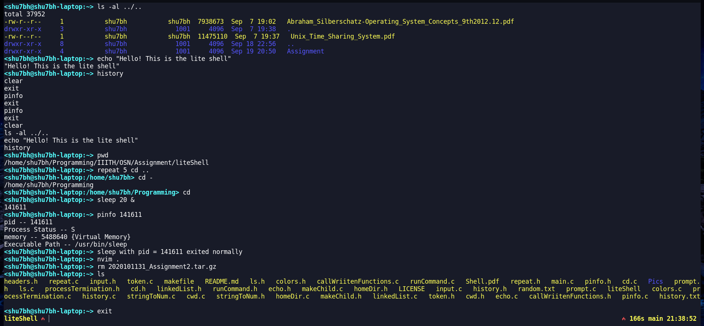

# liteShell

It is a linux shell with basic features. It supports most funcitonalities including multiple commands execution and running background and foreground processes. Command and directory autocompletion is also supported.

**New Feature** Auto Suggestions implemented. You can use ^f or right arrow key to complete it

## Running

Run the following commands on your terminal

```bash
git clone https://github.com/shu7bh/liteShell.git
cd liteShell
make
./liteShell
```

## Features

- It is a shell, which has basic features. Multiple commands can be given at the same time separated by `;`
- It accounts for tabs and spaces.
- Accessing history through up and down arrow key
- Different colours for file and directories
- Autocompletion: It shows the possible options. These options may not always the possible to run. To invoke it, you have to type the first few letters of the command and then press `tab`. As soon as this is pressed, it finds the possible completion options which you can use. To go to the next possible option, you can either press `tab` or `^n`. If you have gone over all the possible commands, it will circulate from the beginning. On the other hand, if you want to go back, you have to use `^b`.
- Input/Output redirection
- Piping is implemented, so multiple commands can be run directly
- Handling signal such as ^c, ^z, ^d
- Auto Suggestions. Shows you a probable suggestion in a greyed out color. It reads it from your history. The more commands you have written, the more likely you will be able to use Auto Suggestions. You can use ^f or right arrow key to fill in the suggestion

## Commands

- cd: Change directory Multiple flags are handled

```bash
  cd
  cd .
  cd ..
  cd ~
  cd dir
```

- echo: prints a message onto the screen

```bash
echo message
```

- ls: Lists directory and flies (flags which can be used are -a and -l)

```bash
ls <dir>
ls -a <dir>
ls -l <dir>
ls -la <dir>
ls -al <dir>
```

- pinfo: Prins the details of a particular process. If no argument is given, it prints details of the foreground process

```sh
pinfo
pinfo <pid>
```

- Foreground process: These are the processes that work in the foreground and execute. We cannot run any other command during this.

```bash
vim
nvim
top
```

To run any process in foreground, type the name of the command the arguments required by it

```bash
command args
```

- Background process: These are the ones that run in the background. Another instance is open in some cases.

```bash
gedit &
emacs &
sleep 5 &
```

To run any process, run & at the end to make it work in the background. Not all processes can be run in the background though

```bash
command args &
```

- repeat: You can use this to repeat the same command multiple times. It takes one argument, i.e. the time in seconds.

```bash
repeat 5 cd ..
```

The above command goes to the 5th parent directory, if it exists. In general, for any command, it has to be executed like this

```bash
repeat n command args
```

- history: Shows the history of the commands input by us. Default is to print the last 10 commands. Can print a max of 20 previous commands.

```bash
history
history 15
```

- jobs: Prints the list of all currently running background processes spawned by the shell in alphabetical order along with the job number and other info. Takes 2 arguments (-s -r)

```bash
jobs
jobs -s
jobs -r
```

- sig: Takes the job number of a running job and sends the signal corresponding to signal number to that process.

```bash
sig 2 9
```

Above command gives signal 9 to job 2

- fg: fg Brings the running or stopped background job corresponding to job number to the foreground, and changes its state to running

```bash
fg 4
```

Above command brings the 2nd job to the foreground

- bg: Changes the state of a stopped background job to running (in the background)

```bash
bg 2
```

Above command brings the 4th job to running state in the background

- replay: This command executes a particular command in fixed time interval for a certain period.

```bash
replay -command echo "hello" >> a.txt -interval 3 -period 6
```

Above command runs `echo "hello" >> a.txt` 2 times, once at 3 seconds and then once at 6 seconds

## Exit

If you want to exit the shell, type exit

## Screenshots


