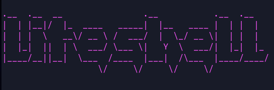

#



*Ease with comfort* — that's what liteShell is all about!

liteShell provides you with a whole new experience by introducing a fancy, memorable shell that allows you to handle commands without a monotonous overtone.

## Running

Paste the following code in your terminal where you want to this shell to exist in

```bash
git clone git@github.com:shu7bh/liteShell.git
cd liteShell
make
./liteShell
```

## Features

1. ### Auto-Suggestions

   - Based on your history of commands, it provides suggestions through which you can convenienty write your code.
   - The suggestion will be shown as a greyed out text.
   - If you want to add that piece of text, you can just run `Ctrl+f` or `right arrow key`

   
   

2. ### Tab Autocompletion

   - If you don't exactly remember the command you want to execute or the files, you can use tab to provide you with options!
   - To invoke it, just type some characters corresponding to it, and then use `tab` or `Ctrl+n`.
   - To go through the suggestions in the reverse order, you can use `Ctrl+b`

   
   
   

3. ### Piping

   - Provides the output of the first command as the input of the next command.
   - Helps to easily segregate, sort, and finally get the preferred output

   ```sh
   ls | wc
   ```

   the `wc` command takes the output from `ls` and prints to the screen

4. ### Input Outpute Redirection

   - Feature to provide input to your command or take the output from the command to a file.

   ```sh
   cat main.c > copyOfMain.c
   wc < makefile
   echo hello >> helloWorld.txt
   ```

   - This feature can be used with pipe to give you full command over your input.

   ```sh
   ls | wc > a.txt
   cat < headers.h | sort | tail > a.txt
   ```

5. ### Multiple commands

   - Using `;`, we can execute multiple commands in a single line.

   ```sh
   ls; sleep 50; firefox &; nvim
   ```

   First executes ls, then sleeps for 50 seconds, opens firefox in the background and then opens nvim in the foreground.

6. ### Accessing history

   - By using up or down arrow key, you can easily go through your previous commands and execute them.
   - To invoke, just press the `up arrow key` or `down arrow key` in your input and it provides you with them. Multiple presses of the same key goes through multiple previous commands.
   - As liteShell stores for upto 10,000 recent commands, there's enough of a database for you to work with.

   
   

7. ### Signal Handling

   - Can easily kill a process, send it to background, bring it to foreground, or just terminate it using signals.
   - Some signals:
     - `Ctrl+c`: To kill a foreground process
     - `Ctrl+z`: To suspend a foreground process and send it to the background process
     - `Ctrl+d`: To log out of the shell

   

8. ### Colorful

   - Provides colorful prompt, error messages, directories and files to easily distinguish and keep it a refreshing shell experience.

   

## Commands

1. ### cd

   Change directory Multiple flags are handled

   ```sh
   cd
   cd .
   cd ..
   cd ~
   cd dir
   ```

2. ### echo

   prints a message onto the screen

   ```sh
   echo message
   ```

3. ### ls

   Lists directory and flies (flags which can be used are -a and -l)

   ```sh
   ls <dir>
   ls -a <dir>
   ls -l <dir>
   ls -la <dir>
   ls -al <dir>
   ```

4. ### pinfo

   Prints the details of a particular process. If no argument is given, it prints details of the foreground process

   ```sh
   pinfo
   pinfo <pid>
   ```

5. ### Foreground process

   These are the processes that work in the foreground and execute. We cannot run any other command during this.

   ```sh
   vim
   nvim
   top
   sleep 5
   ```

   To run any process in foreground, type the name of the command the arguments required by it

   ```sh
   command args
   ```

6. ### Background process

   These are the ones that run in the background. Another instance is open in some cases.

   ```sh
   gedit &
   emacs &
   sleep 5 &
   ```

   To run any process, run & at the end to make it work in the background. Not all processes can be run in the background though

   ```sh
   command args &
   ```

7. ### repeat

   You can use this to repeat the same command multiple times. It takes one argument, i.e. the time in seconds.

   ```sh
   repeat 5 cd ..
   ```

   The above command goes to the 5th parent directory, if it exists. In general, for any command, it has to be executed like this

   ```sh
   repeat n command args
   ```

8. ### history

   Shows the history of the commands input by us. Default is to print the last 10 commands. Can print a max of 20 previous commands.

   ```sh
   history
   history 15
   ```

9. ### jobs

   Prints the list of all currently running background processes spawned by the shell in alphabetical order along with the job number and other info. Takes 2 arguments (-s -r)

   ```sh
   jobs
   jobs -s
   jobs -r
   ```

10. ### sig

      Takes the job number of a running job and sends the signal corresponding to signal number to that process.

      ```sh
      sig 2 9
      ```

      Above command gives signal 9 to job 2

11. ### fg

      fg Brings the running or stopped background job corresponding to job number to the foreground, and changes its state to running

      ```sh
      fg 4
      ```

      Above command brings the 4th job to the foreground

12. ### bg

      Changes the state of a stopped background job to running (in the background)

      ```sh
      bg 2
      ```

      Above command brings the 2nd job to running state in the background

13. ### replay

      This command executes a particular command in fixed time interval for a certain period.

      ```sh
      replay -command echo "hello" >> a.txt -interval 3 -period 6
      ```

      Above command runs `echo "hello" >> a.txt` 2 times, once at 3 seconds and then once at 6 seconds

14. ### baywatch

      This command executes a particular watch every n seconds

      ```sh
      baywatch -n 5 interrupt
      baywatch -n 2 dirty
      baywatch -n 10 newborn
      ```

      The first command on the top prints the interrupt for the CPUs every 5 seconds unless q is pressed.

15. ### exit

      To exit liteShell, type exit

      ```sh
      exit
      ```

## Screenshots


